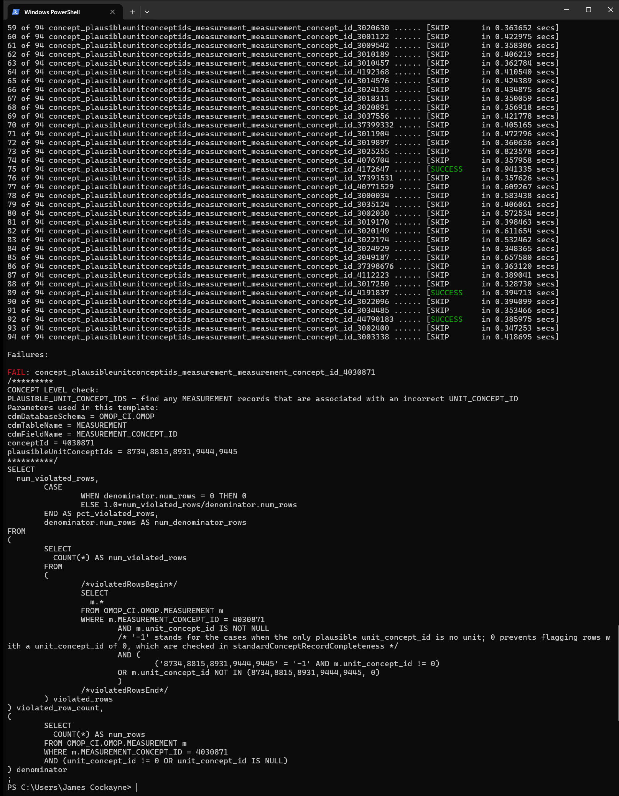

# dqd_console_results

[](https://github.com/james-cockayne/dqd_console_results/actions/workflows/build-and-test.yml)

A .NET console application that parses OHDSI Data Quality Dashboard `results.json` files and displays test outcomes in the terminal, styled after dbt's log output.

## Features

- Lists all checks by `checkId` with outcome: SUCCESS, FAIL, SKIP, or SUPPRESSED
- Colour-coded status in terminal output (green for success, red for fail)
- Displays full SQL for any failed checks
- Supports suppressing known failures via environment variable
- Returns a non-zero exit code if there are any non-suppressed failures

## Example output



## Usage

### Run

```bash
docker run --rm -it -v /path/to/results:/data ghcr.io/james-cockayne/dqd-console-results:latest /data/results.json
```

### Run with suppressed tests


Set the `SUPPRESSED_TESTS` environment variable to a pipe-separated list of `checkId` values:

```
SUPPRESSED_TESTS=table_cdmtable_metadata|table_cdmtable_visit_occurrence
```

Suppressed failures are listed with a SUPPRESSED status and do not cause a non-zero exit code.

```bash
docker run --rm -it -v /path/to/results:/data -e SUPPRESSED_TESTS=table_cdmtable_metadata|table_cdmtable_visit_occurrence ghcr.io/james-cockayne/dqd-console-results:latest /data/results.json
```